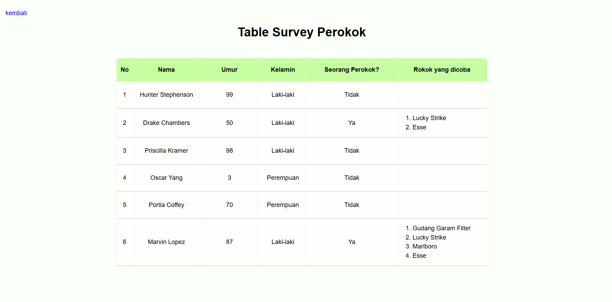
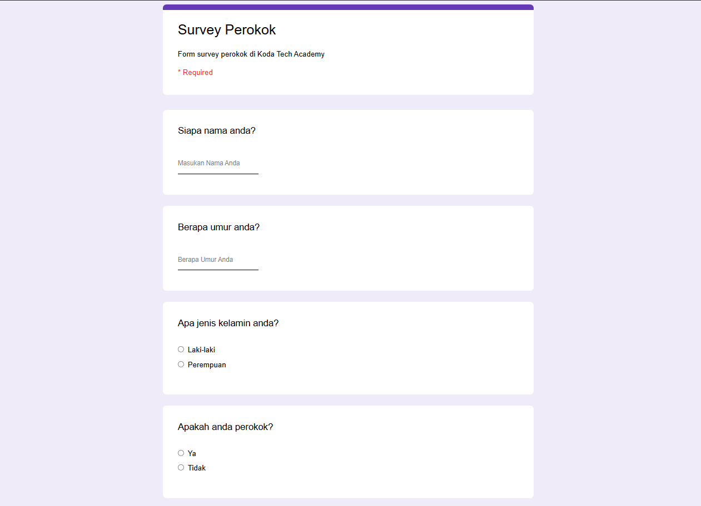

# Form Survey Perokok

### Mini-task html4 terkait form yang meniru terhadap google form dan tampilkan di Table.

Penggunaan layout CSS pada task ini cenderung menggunakan flexbox dengan beberapa properties meliputi:
- flex-direction 
- gap 
- justify-content 
- align-items 
- justify-self

## Preview Demo
  
Table

## Updated
Program ini diupdate dengan menerapkan beberapa Library antara lain:
- Tailwind untuk styling dan mengubah semua alur dari manual css ke class based styling
- jQuery untuk manipulasi DOM.

## Preview Demo styling dengan Tailwind & jQuery
